# BedRock版教程
::: tip 提示
如果您已经安装了1.20.1的基岩版，请跳至[**第3步**](#_3)
:::
## 1
下载1.20.1基岩版mc并安装。[Minecraft Bedrock 1.20.1](https://mcapks.net/info/MS4yMC4xLjAy/32e6835e669aa1ffe5fe344c37b6cd7e.html)
::: warning 提示
如下载后无法安装或无法打开(闪退)，请尝试下载32位版
:::
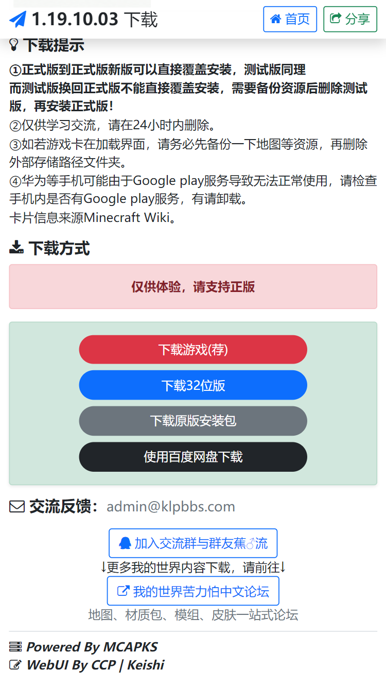
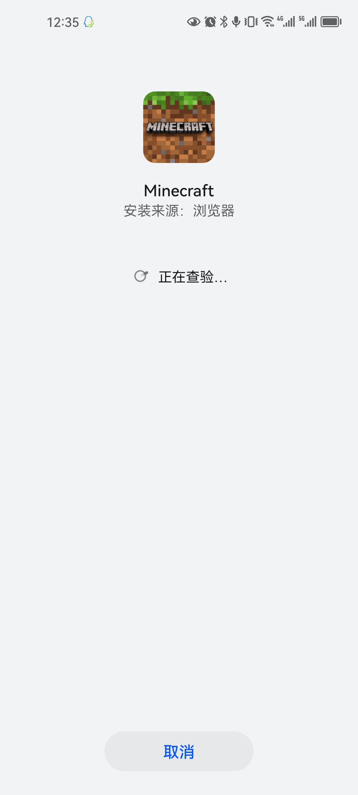
## 2
打开mc，注册或登录微软账号；
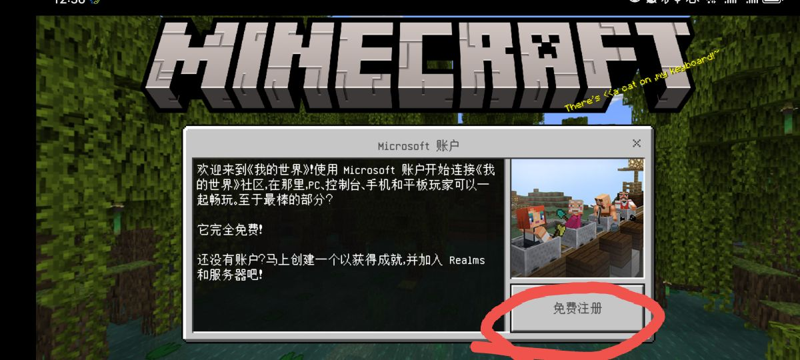
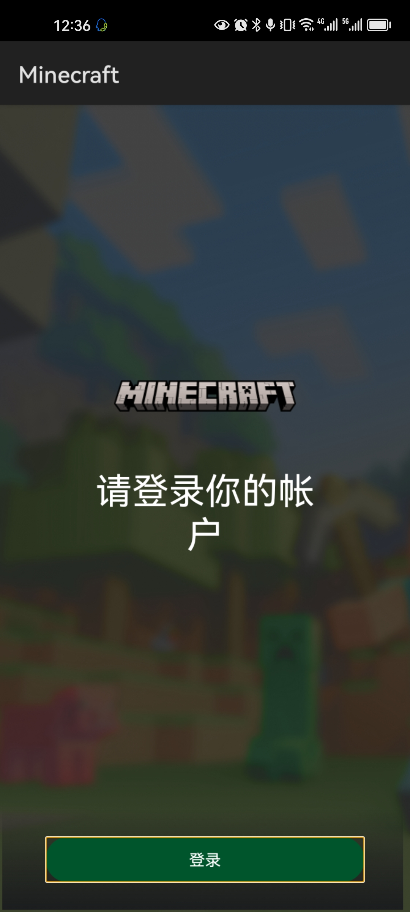
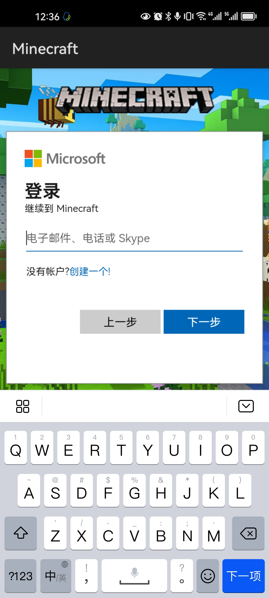
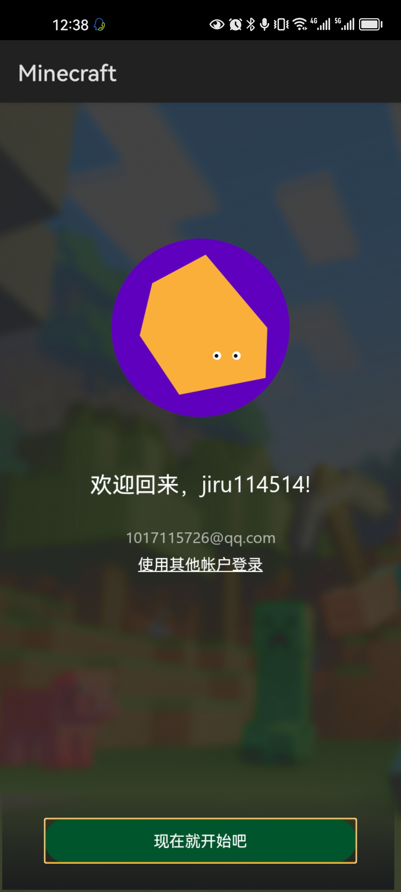
## 3
访问[阴云皮肤](https://skin.yinyuns.top/)，按照[使用指南](https://docs.yinyuns.top/yinyunskin/guide/create-account)进行阴云皮肤的注册登录
## 4
返回首页，点击“游戏”
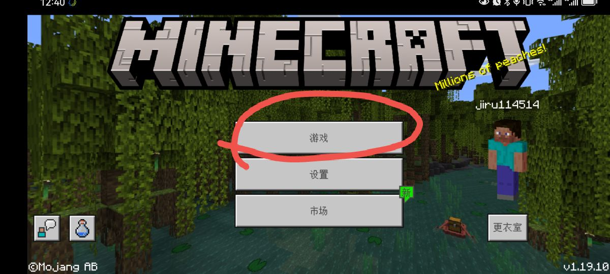
点击“服务器”
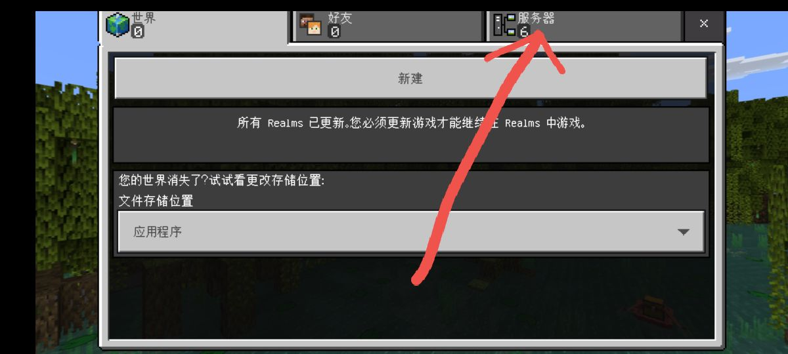
将列表拖至底部，点击“添加服务器”
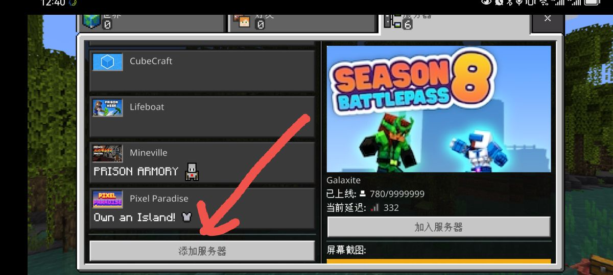
填入服务器名称及地址，随后点击保存（服务器名称自取，服务器地址请在群公告中查看）
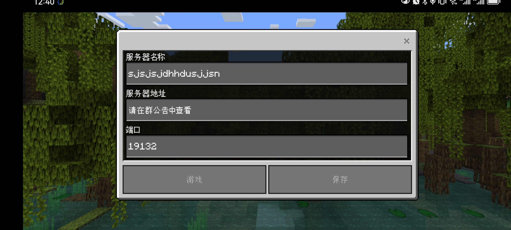
找到刚刚添加的服务器，点击“加入服务器”
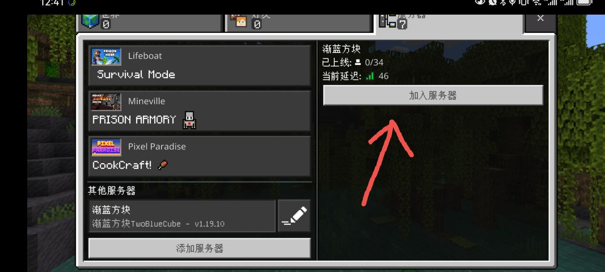
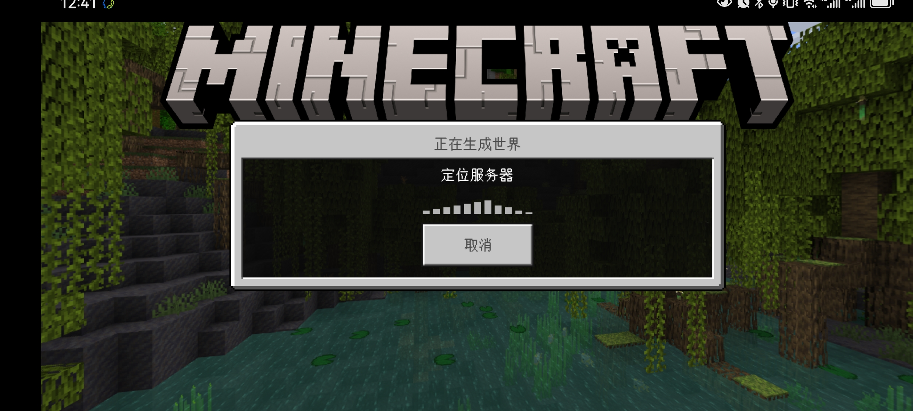
加载完成后点击“使用Mojang账户登录”，填入自己皮肤站的账号密码并提交即可进入服务器。
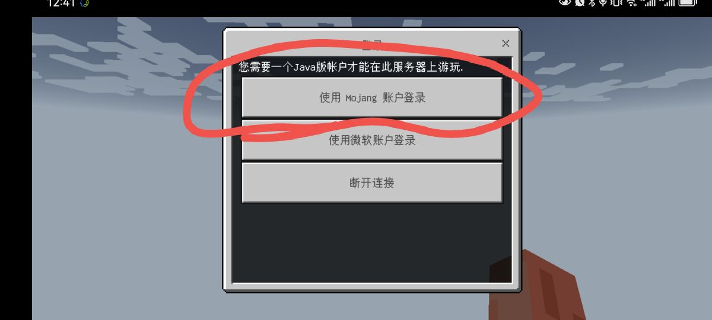
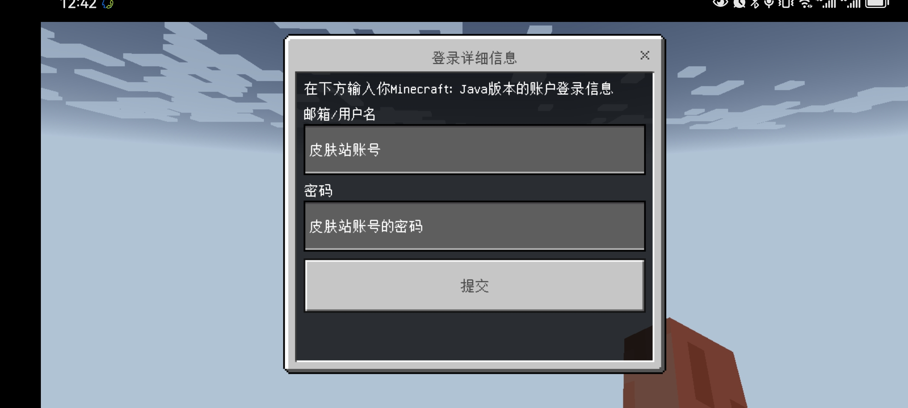
