# Java版教程

::: tip 提示
如您已有1.18.2的Java版，则可以直接进行 [皮肤站](#皮肤站) 步骤
:::

## 启动器

::: warning 说明
Minecraft Java版的启动器多种多样，在本教程中，我们只列出BakaXL的教程，其他启动器还请自行研究
:::

前往BakaXL官网[BakaXL - 新一代Minecraft崩坏启动器](https://www.bakaxl.com/)下载启动器 
将启动器放在一个空文件夹内，如图 (不是一定要在C盘，其他磁盘也可以)
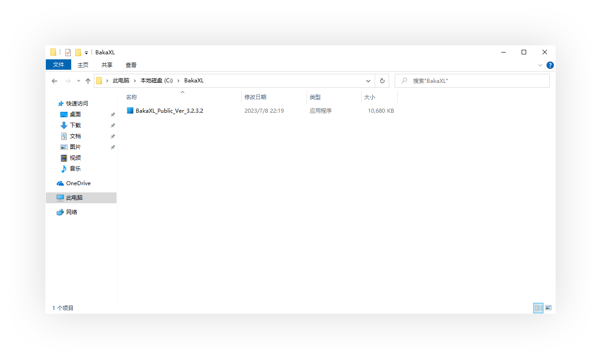

运行启动器，如出现如下弹窗，请点击`运行`

BakaXL将引导您进行一些设置
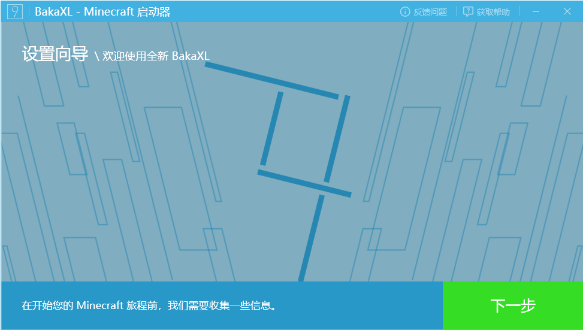

按照其提示完成设置，其中下列界面的设置须按照本教程进行设置。 
在`快速设置`界面，请选择`使用快速设置`
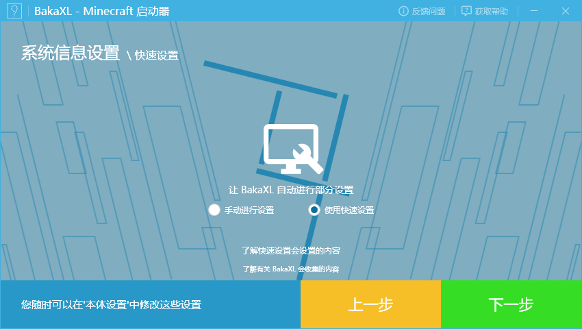

在`创建用户档案`界面，请登录，如您没有正版账号，请点击`我没有购买正版 Minecraft`，进行离线登录
::: tip 请注意
进入渐蓝方块将使用阴云皮肤，而不是正版或者离线账号。故在此界面您选择哪种登录方式都不影响后续步骤，无需太多顾虑
:::
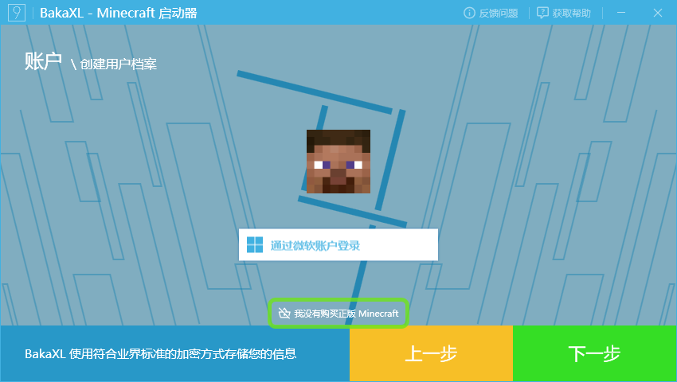

当出现"`设置向导现已完成`"时，请点击`安装 Minecraft 核心 →`
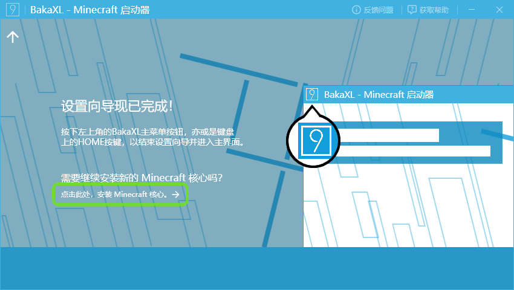

在右侧列表中找到1.18.2，选择
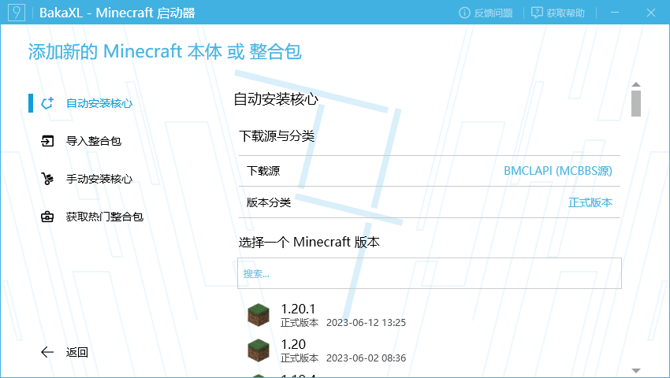

将右侧列表滚动至最下方，点击`立即安装`。
等待安装完成后，点击`返回`，回到主界面
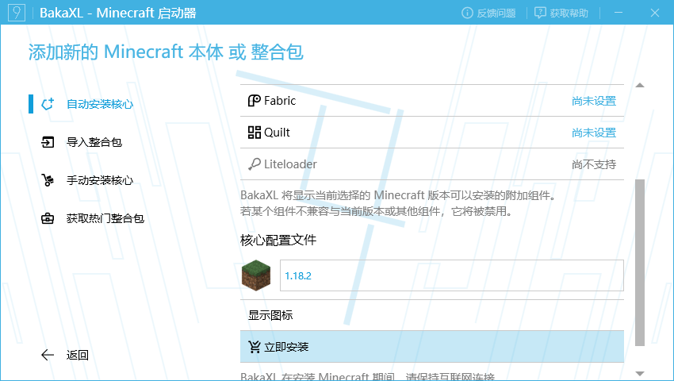

## 皮肤站

打开浏览器，访问[阴云皮肤](https://skin.yinyuns.top/)，按照[使用指南](https://docs.yinyuns.top/yinyunskin/guide/create-account)进行阴云皮肤的注册登录，并完成启动器配置

## 启动

在启动器的主界面，点击`开始游戏`
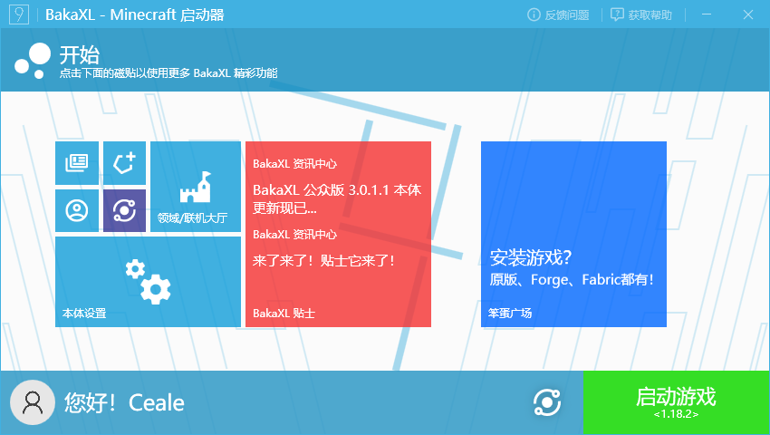

启动器将弹出界面让您选择启动游戏所使用的账号，选择您使用阴云皮肤登录的那一个
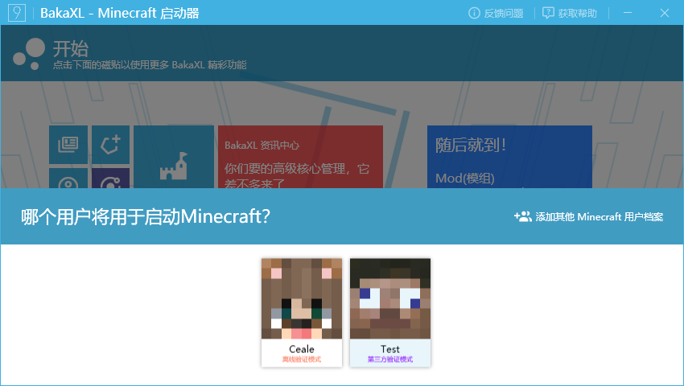

如启动器提示`未找到合适的 Java 虚拟机...`，请选择`好`
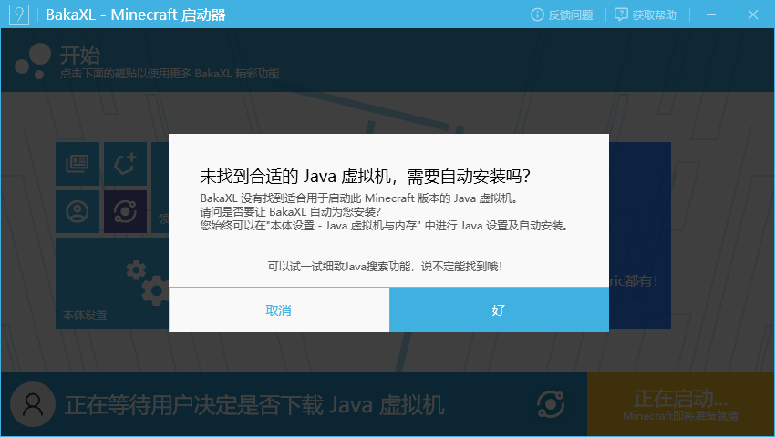

至此，您应该已经正确的使用阴云皮肤账号启动了Minecraft

## 游戏内

Minecraft启动完成后，点击小地球按钮切换语言
::: tip 提示
若您的MInecraft已经为简体中文或您习惯其他语言，请跳过这一步骤 
左下`强制使用Unicode字体`请按照个人喜好开关
:::

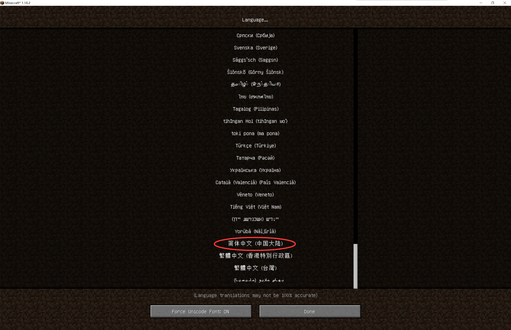

点击`多人游戏`

点击“添加服务器”，填入服务器名称及地址，随后点击完成。
::: tip 提示
服务器名称是仅在您本地显示的名称，填入任意名称都可以。服务器地址请在群公告中查看
:::
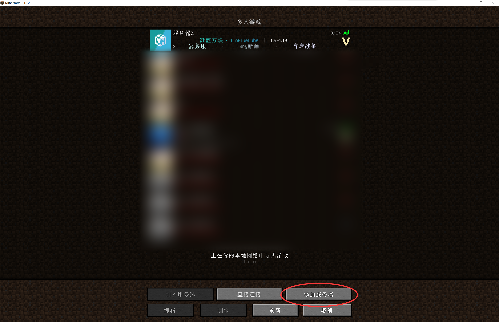
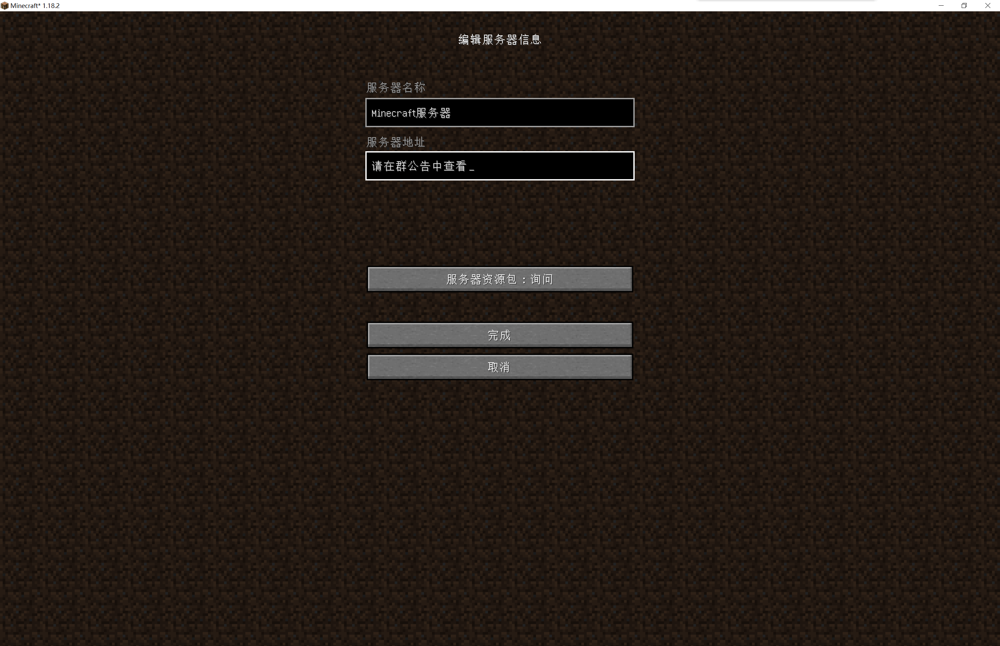

找到刚刚添加的服务器，双击即可进入服务器
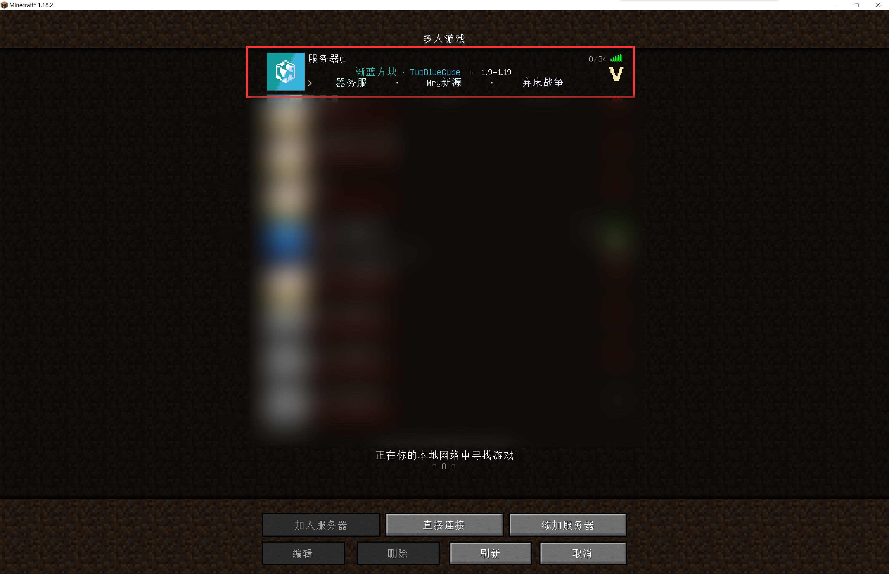

# 欢迎来到渐蓝方块！