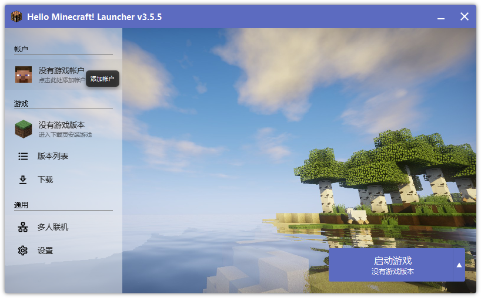
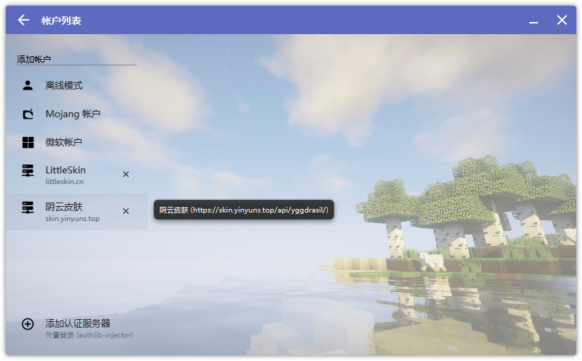
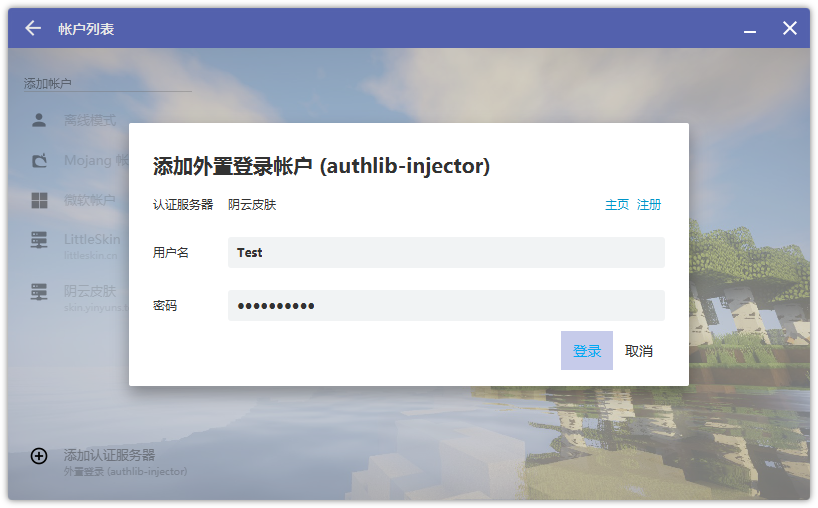
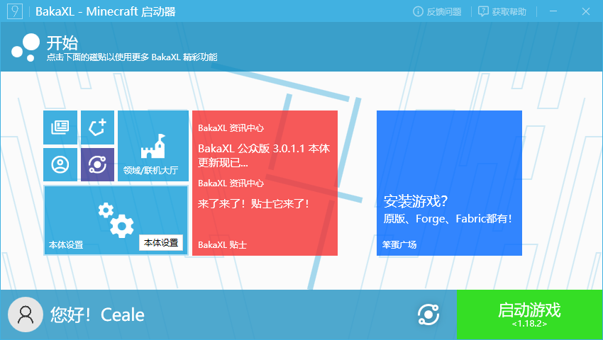
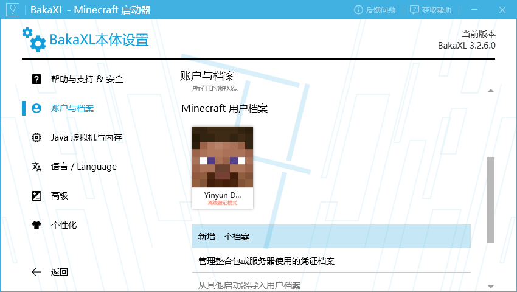
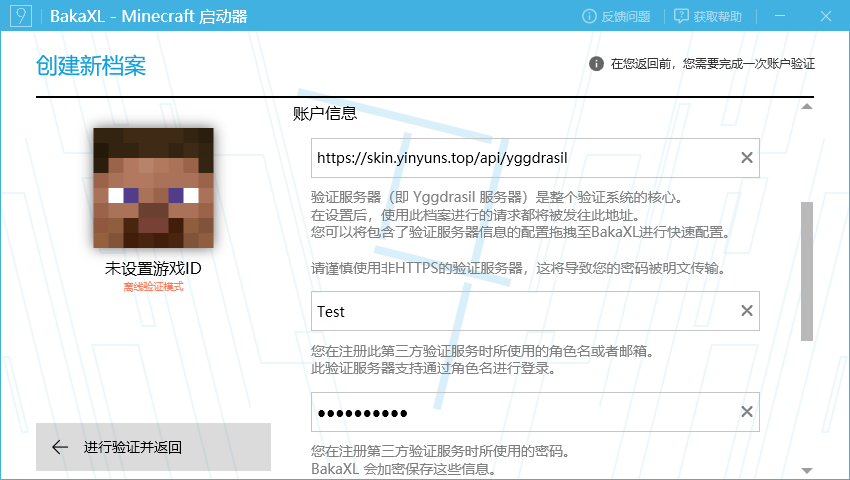
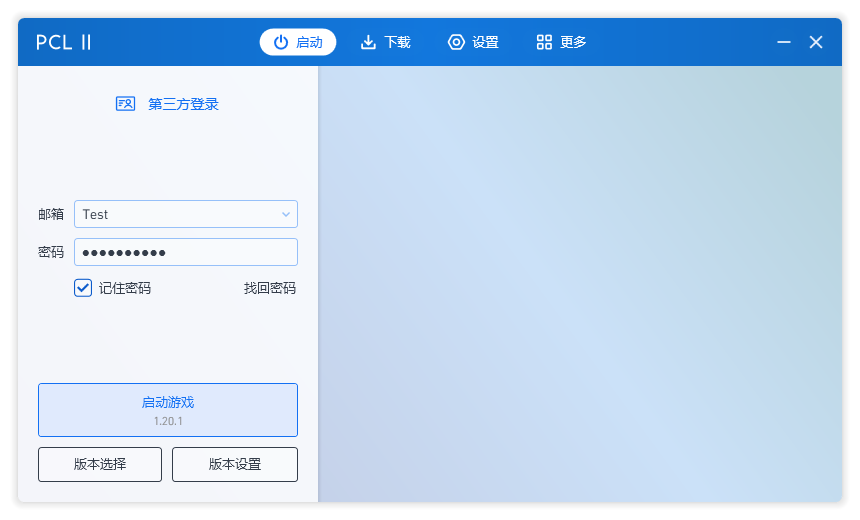
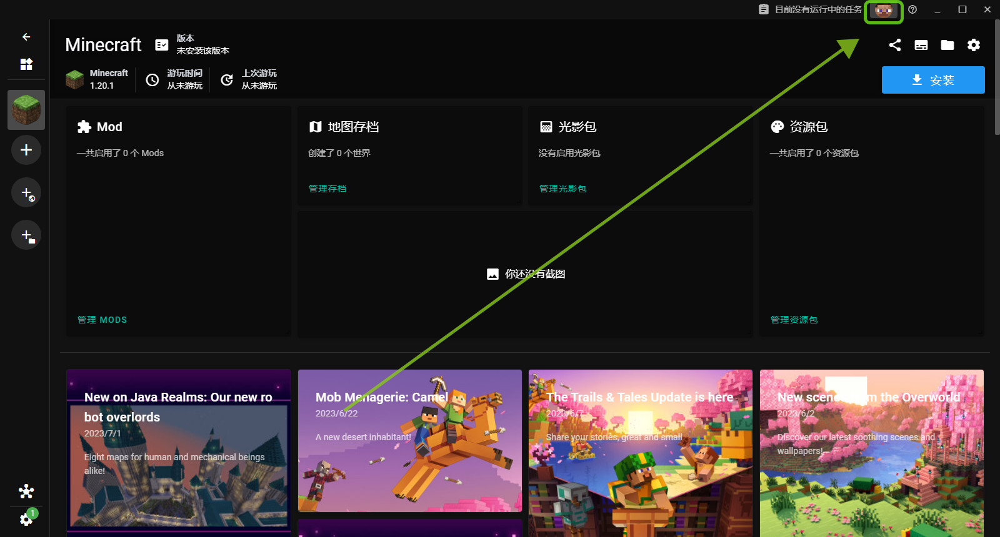
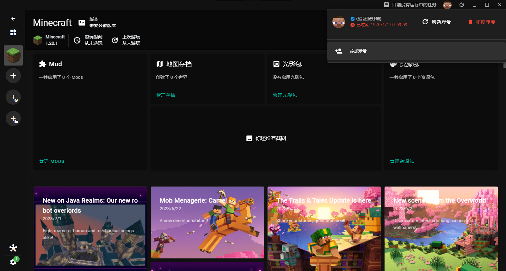
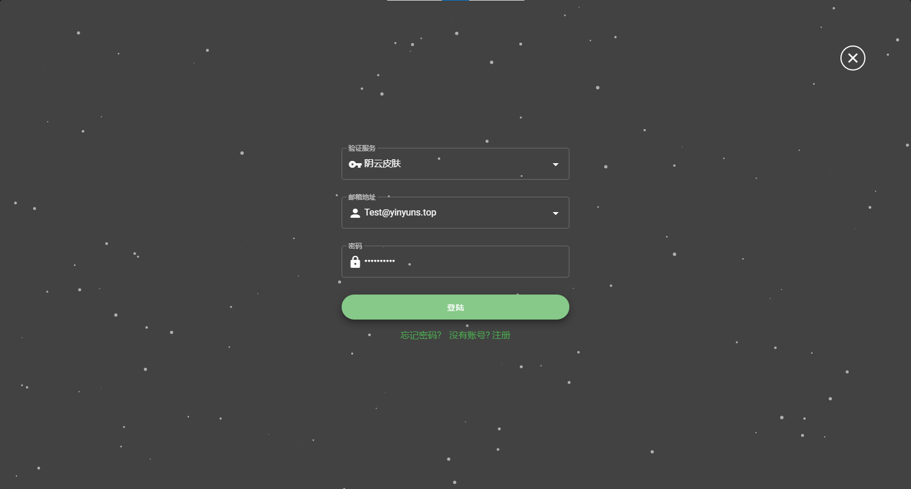

# 启动器设置
::: warning 说明
Minecraft启动器数量众多，本文档无法列出全部启动器的教程，只能写出其中部分的教程，其他启动器还请自行研究 
此外教程只列出有关外置登录的部分，关于启动游戏等部分不在教程教学范围内
:::

::: tip 本文档所给出教程的启动器
HMCL [Hello Minecraft Launcher](https://hmcl.huangyuhui.net/) 
BakeXL [BakaXL - 新一代Minecraft崩坏启动器](https://www.bakaxl.com/) 
PCL2 [Plain Craft Launcher 2](https://afdian.net/p/0164034c016c11ebafcb52540025c377) 
XMCL [X Minecraft Launcher - 一个现代化的 Minecraft 启动器](https://xmcl.app/) 
如果你想为文档添加更多启动器的教程，欢迎前往[本文档仓库](https://github.com/YinyunStudio/Old-YinyunDocs)
:::

对于大部分启动器，添加阴云皮肤作为外置登录需要以下两个步骤： 
1.添加外置登录，填入`https://skin.yinyuns.top/api/yggdrasil` 
2.添加账号，选择阴云皮肤，输入账号密码

## HMCL

打开[用户中心](https://skin.yinyuns.top/user)，将`将此按钮拖动至启动器`拖动至启动器，如下
<video controls src="./HMCL-v1.mp4"></video>

点击`用户`

点击`阴云皮肤`

填入账号密码，并点击登录

## BakaXL

点击左下`本体设置`

在左侧边栏点击`账户与档案`，在右侧向下滚动，点击`新增一个档案`

打开[用户中心](https://skin.yinyuns.top/user)，将`将此按钮拖动至启动器`拖动至启动器，如下
<video controls src="./BakaXL-v1.mp4"></video>

点击`进行验证并返回`

## PCL2

::: tip 提示
PCL2中，外置登录的设置是基于版本的 
您因先选择**要使用阴云皮肤的游戏版本**再进行下列操作
:::

打开[用户中心](https://skin.yinyuns.top/user)，将`将此按钮拖动至启动器`拖动至启动器，如下
<video controls src="./PCL2-v1.mp4"></video>

填入账号密码，并点击`启动游戏`<s>阴云皮肤，启动！</s>

## XMCL

打开[用户中心](https://skin.yinyuns.top/user)，将`将此按钮拖动至启动器`拖动至启动器，如下
<video controls src="./XMCL-v1.mp4"></video>

点击界面右上角的**头像**

点击`添加账号`

填入账号密码，并点击`登陆`
